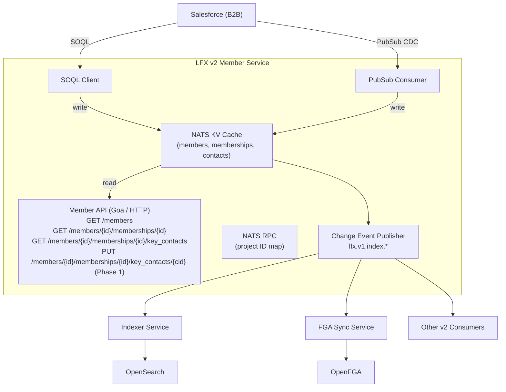

<!--
Copyright The Linux Foundation and each contributor to LFX.
SPDX-License-Identifier: CC-BY-4.0
-->

# V2 Member Service Architecture

This document captures the target architecture and phased refactoring plan for the LFX v2 Member Service.

## Background

The current v2 Member Service is built on top of the v1 infrastructure:

1. A scheduled **sync job** queries a PostgreSQL replica of Salesforce data (maintained by the v1 platform) and bulk-copies records into NATS KV buckets.
2. The **member API** serves read-only endpoints that fetch directly from those NATS KV buckets.

This design has several limitations:

- **Tight coupling to v1.** Detaching from the v1 PostgreSQL replica requires a full pipeline replacement.
- **Stale data.** The scheduled sync introduces latency between Salesforce and the API.
- **No OpenFGA integration.** Membership data is not indexed into OpenFGA, so access decisions are limited to simple authentication checks rather than fine-grained relationship-based authorization.
- **No OpenSearch integration.** Membership data is not indexed into OpenSearch, so the Query Service cannot be used for search or filtering.
- **Key contacts are read-only.** There is currently no write path for key contacts; enabling editability requires a direct Salesforce integration.

## Target Architecture

The target architecture replaces the PostgreSQL replica dependency with a direct Salesforce integration, adds real-time change processing via the Salesforce PubSub API, and integrates with the LFX v2 platform services (Indexer → OpenSearch, FGA Sync → OpenFGA).



### Key design decisions

- **Direct SOQL queries replace the PostgreSQL replica.** The member service holds Salesforce credentials and queries `salesforce_b2b` data directly via SOQL. The v1 PostgreSQL replica is no longer required.
- **NATS KV as a shared cache.** Query results are cached in NATS KV buckets with TTLs for cross-replica coherence. This preserves the existing read path (API reads from NATS KV) while removing the dependency on the sync job.
- **Salesforce PubSub for real-time updates.** The PubSub consumer listens for change events from Salesforce and refreshes the relevant KV entries, triggering downstream change events.
- **Change event publishing.** After writing to NATS KV, the service publishes a `lfx.v1.index.*` NATS message so the Indexer and FGA Sync services receive updates without polling.
- **NATS RPC endpoint for project ID mapping.** A lightweight NATS request/reply handler exposes the mapping of v2 Project UID → Salesforce `Project__c.Id`, enabling other services (such as the Indexer) to resolve project references without a direct PostgreSQL dependency.

---

## V2 Entity Model

### OpenFGA types

These types participate in the OpenFGA relationship model and are subject to fine-grained, per-object access control.

| OpenFGA type | Description | Relations |
|---|---|---|
| `member` | An organization (Salesforce Account) that holds one or more memberships. | `auditor`: users or teams authorized to view membership details for this account. |

**OpenFGA model fragment:**

```plain
type member
  relations
    define auditor: [user, team#member]
```

The `auditor` relation provides read access to membership details and key contacts for a specific member. It does not propagate to unrelated member objects. Staff roles that need cross-member visibility should be granted `auditor` via a team relation.

### Pseudotypes (Indexer / Query Service only)

These types are indexed into OpenSearch and queryable via the Query Service. They do not appear in the OpenFGA model and carry no per-object permission tuples; access to them is mediated by the `member` OpenFGA type they belong to.

| Pseudotype | Description | API path | Permission anchor |
|---|---|---|---|
| `membership` | A single Salesforce Asset record representing a membership term. | `/members/{member_id}/memberships/{id}` | `auditor` on `member:{member_id}` |
| `membership_key_contact` | A key contact role (Salesforce `OpportunityContactRole` or equivalent) attached to a membership. | `/members/{member_id}/memberships/{id}/key_contacts` | `auditor` on `member:{member_id}` |

> **Note:** `membership` and `membership_key_contact` are pseudotypes: they do not have their own OpenFGA type definitions and cannot be referenced as independent subjects or objects in OpenFGA tuples. Permissions for these resources are always derived from the parent `member` type.

### Entity attribute sets

Following the platform's [entity design guidance](https://github.com/linuxfoundation/lfx-v2-helm/blob/ems/entity-docs/docs/entity-design.md), the member entity is currently served as a single attribute set accessible to the `auditor` relation. If future business requirements introduce attributes with different read/write permission boundaries (e.g., formation details writable only by owners), those attributes should be split into a new endpoint and attribute set.

---

## Phased Implementation Plan

### Phase 1: Replace PostgreSQL pipeline; enable key contacts editability

**Goal:** Remove the sync job's dependency on the v1 PostgreSQL replica and unblock key contacts editability. The API contract is unchanged for consumers.

#### 1.1 Direct SOQL query client

- Add a Salesforce SOQL client (using the Salesforce REST API or a Go SOQL library) to the member service.
- Implement `MembershipSourceReader` using SOQL queries equivalent to the existing PostgreSQL queries. The domain model (`model.Membership`, `model.Member`, `model.KeyContact`) and UID generation logic (`uuid.NewSHA1`) remain unchanged.
- Store Salesforce credentials (client ID, client secret, instance URL) in Kubernetes secrets, injected as environment variables.

#### 1.2 NATS KV caching with TTL

- Replace bulk-purge-and-refill sync with targeted per-record writes on cache miss or explicit refresh.
- Set a TTL on KV bucket entries (suggested: 24 hours). A cache miss triggers a SOQL fetch for that record and a KV write.
- Background refresh: before expiry, proactively re-fetch records that are accessed frequently. (This can be deferred; cache miss fallback is sufficient for Phase 1.)

#### 1.3 Key contacts write path

- Add write endpoints (PUT / DELETE) for key contacts to the Goa design.
- Implement a Salesforce write client for mutating `OpportunityContactRole` (or equivalent) records via the REST API.
- On successful write to Salesforce, invalidate or update the corresponding NATS KV entry.
- Update the Heimdall ruleset to enforce the `writer` relation on `member:{member_id}` for write operations.

#### 1.4 NATS RPC endpoint: project ID mapping

- Implement a NATS request/reply handler (subject: `lfx.member.project-id-map.lookup` or similar) that returns the Salesforce `Project__c.Id` for a given v2 Project UID.
- This allows the Indexer and other consumers to resolve project references without querying PostgreSQL.

#### 1.5 Deprecate the sync job

- Once the SOQL-backed NATS KV cache is in production and validated, retire the scheduled `cmd/sync` job and remove the PostgreSQL infrastructure dependency from the Helm chart.

---

### Phase 2: Salesforce PubSub; FGA Sync and Indexer pipelines; backfill

**Goal:** Achieve real-time data consistency and full integration with the LFX v2 platform (OpenFGA, OpenSearch).

#### 2.1 Salesforce PubSub consumer

- Subscribe to the relevant Salesforce Change Data Capture (CDC) event channels for `Asset`, `Account`, and contact-role objects.
- On receiving a change event, update the NATS KV cache for the affected record(s).
- Publish a change notification on the NATS JetStream subject `lfx.v1.index.{object_type}` so downstream consumers (Indexer, FGA Sync) receive updates without polling.

#### 2.2 Indexer pipeline integration

- Publish `lfx.v1.index.member`, `lfx.v1.index.membership`, and `lfx.v1.index.membership_key_contact` messages after each write to NATS KV.
- Confirm that the Indexer service recognizes these object types and indexes them into OpenSearch under the `member`, `membership`, and `membership_key_contact` type mappings.

#### 2.3 FGA Sync pipeline integration

- After writing a `member` record to NATS KV, publish a message to the FGA Sync subject so the `member` OpenFGA type is created or updated.
- Ensure that `auditor` tuple writes (e.g., assigning a user as auditor of a member) are handled via FGA Sync, not directly by the member service.

#### 2.4 OpenFGA and OpenSearch backfill

- Implement a one-time backfill job (or a flag on the existing sync job) that:
  1. Iterates all member records in NATS KV.
  2. Publishes Indexer messages for each `member`, `membership`, and `membership_key_contact` record.
  3. Publishes FGA Sync messages for each `member` record so that existing `auditor` tuples are populated.
- Run the backfill once during the Phase 2 rollout, then disable it.

---

## NATS KV Bucket Reference

| Bucket | Key pattern | Value | TTL |
|---|---|---|---|
| `members` | `{member_uid}` | `model.Member` (JSON) | 24 h |
| `members` | `lookup/member-sfid/{sfid}` | member UID | 24 h |
| `members` | `lookup/member-project/{project_id}/{member_uid}` | member UID | 24 h |
| `memberships` | `{membership_uid}` | `model.Membership` (JSON) | 24 h |
| `memberships` | `lookup/member-membership/{member_uid}/{membership_uid}` | membership UID | 24 h |
| `memberships` | `lookup/project/{project_id}/{membership_uid}` | membership UID | 24 h |
| `membership-contacts` | `{contact_uid}` | `model.KeyContact` (JSON) | 24 h |
| `membership-contacts` | `lookup/membership/{membership_uid}/{contact_uid}` | contact UID | 24 h |

---

## API Endpoint Summary

| Method | Path | Description | Phase | OpenFGA check |
|---|---|---|---|---|
| GET | `/members` | List/search members | Current | `auditor` on `member` (allow_all) |
| GET | `/members/{member_id}/memberships/{id}` | Get a membership | Current | `auditor` on `member:{member_id}` |
| GET | `/members/{member_id}/memberships/{id}/key_contacts` | List key contacts | Current | `auditor` on `member:{member_id}` |
| PUT | `/members/{member_id}/memberships/{id}/key_contacts/{cid}` | Update a key contact | Phase 1 | `writer` on `member:{member_id}` |
| DELETE | `/members/{member_id}/memberships/{id}/key_contacts/{cid}` | Remove a key contact | Phase 1 | `writer` on `member:{member_id}` |
| POST | `/members/{member_id}/memberships/{id}/key_contacts` | Add a key contact | Phase 1 | `writer` on `member:{member_id}` |

---

## Environment Variable Changes

Phase 1 introduces Salesforce credentials and removes the PostgreSQL dependency.

| Variable | Description | Phase | Required |
|---|---|---|---|
| `SF_INSTANCE_URL` | Salesforce instance URL (e.g., `https://linuxfoundation.my.salesforce.com`) | 1 | Yes |
| `SF_CLIENT_ID` | Salesforce connected app client ID | 1 | Yes |
| `SF_CLIENT_SECRET` | Salesforce connected app client secret | 1 | Yes |
| `SF_API_VERSION` | Salesforce API version (e.g., `v60.0`) | 1 | No (default: `v60.0`) |
| `RDSDB` | PostgreSQL connection string (sync job only) | Deprecated in Phase 1 | — |
| `SF_PUBSUB_ENDPOINT` | Salesforce PubSub gRPC endpoint | 2 | Yes |

---

## Lessons from the V1 Implementation

The v1 `member-management` service has been running this Salesforce integration in production for several years. The following patterns and failure modes are directly relevant to the v2 write path and should inform implementation decisions.

### The actual dual-schema architecture

The v1 platform database has **two distinct schemas** that both contain Salesforce-derived data, which is the source of the "dual schema" observation:

- **`salesforce_b2b`**: A direct mirror of the B2B Salesforce org, populated every 30 minutes by Stitch. Tables use quoted PascalCase names (e.g. `"Account"`, `"Project_Role__c"`) and a quoted `"Id"` primary key. The v3 key contacts and membership write path uses this schema exclusively.
- **`salesforce`**: The B2C schema, which for historical reasons uses the same Salesforce-style column naming but with lowercase table names and `sfid` as the primary key. This schema is populated by a pg_cron stored procedure (`salesforce.sync_stitch_platformrdsdb`) that copies a subset of records from `salesforce_b2b` into `salesforce` on a scheduled basis. The older v1 membership read endpoints (`membership/repository.go`) query `salesforce.asset`, `salesforce.project_role__c`, etc. from this schema.

So the "dual schema" is real, but the relationship is: **`salesforce_b2b` (B2B Stitch mirror) → pg_cron stored procedure → `salesforce` (B2C platform schema)**. The v3 accounts/memberships code queries `salesforce_b2b` directly; the older v1 code queries the `salesforce` copy. There is no separate "live" schema in the sense of platform-written records being merged back into the Stitch copy.

### The `temp_sfdc_id` dual-ID pattern (read-your-writes)

The v1 service solves the read-your-writes problem at the row level using a `temp_sfdc_id` column that exists on every mutable table in `salesforce_b2b` (`Contact`, `Project_Role__c`, `Address__c`, etc.).

The write flow is:

1. **Write to Salesforce first.** The REST API call returns the new record's canonical SFDC `Id` immediately.
2. **Write a shadow row to the local PostgreSQL replica.** The canonical SFDC `Id` is stored in `temp_sfdc_id`; a locally-generated UUID is stored in the primary-key `Id` column. This prevents a primary key violation when the Stitch batch sync later arrives with the same record using the real SFDC `Id`.
3. **Query using `COALESCE(temp_sfdc_id, "Id")`.** All read queries resolve the identity of a record through this expression, so the shadow row is immediately visible and indistinguishable from a fully-synced row.
4. **Stitch arrives ~30 minutes later.** The batch sync inserts the record with the real SFDC `Id` as the primary key. A background database job detects that `temp_sfdc_id` on the old shadow row now matches an `Id` on the newly-synced row, and deletes the shadow row.

**V2 implication:** The v2 NATS KV cache acts as the equivalent of the shadow row. When a write to Salesforce succeeds, the service must immediately write the updated record into NATS KV (keyed by the v2 UID) so that subsequent reads are coherent. The v2 UID is derived deterministically from the Salesforce SFDC `Id` (`uuid.NewSHA1(namespace, "lfx-key-contact:"+sfid)`), which is returned synchronously by the Salesforce REST write API—so no temporary ID indirection is needed. The KV entry should be written before the HTTP response is returned to the client.

### Salesforce session management

V1 uses a **username + password + client credentials** OAuth flow (`credentials.NewPasswordCredentials`) and caches the resulting session object in a package-level global variable (`salesforceSession`). The session is re-opened lazily when nil, and reset explicitly (`ResetSFDCSession()`) on auth errors. This approach works but has two known issues:

- The cached session token can expire mid-request, causing sporadic 401s that require a retry and session reset.
- In a multi-replica deployment (Lambda in v1, Kubernetes in v2), each replica holds its own session, meaning token refresh is not coordinated.

**V2 implication:** Prefer a **Connected App with OAuth 2.0 JWT Bearer flow** (private key + client ID, no username/password) for the v2 service. This is more suitable for server-to-server auth, supports token refresh without user credentials, and is the Salesforce-recommended pattern for headless services. Session tokens should be refreshed proactively before expiry rather than reactively on 401, and should be shared across goroutines with a mutex or a token-source abstraction (e.g., `golang.org/x/oauth2`).

### Write-path race conditions and retry logic

V1's `CreateAccountProjectContactRole` reveals several real-world races that any write path to Salesforce will encounter:

- **Concurrent duplicate creation.** Multiple in-flight requests can attempt to create the same Contact or ProjectRole simultaneously (e.g., two tab submissions). V1 handles this with a Redis lock keyed on the contact email and a retry loop with random jitter (300–600 ms, up to 10 iterations) that polls the local DB until the first writer's shadow row appears. V2 should implement a similar idempotency guard, either via a NATS KV compare-and-set (revision-based CAS) or an application-level distributed lock.
- **SFDC exclusive-lock contention.** Salesforce can reject concurrent writes to related records with a lock conflict error. V1 retries up to 10 times with random delay. V2 should treat this error class as retryable and use exponential backoff with jitter rather than a fixed random interval.
- **Self-heal for orphaned platform engagements.** If the Salesforce write succeeds but a downstream step (e.g., creating the org-dashboard engagement) fails, V1 detects the inconsistency on the next duplicate-creation attempt and re-runs the downstream step rather than failing. V2's equivalent would be detecting a KV entry that lacks the expected downstream indexing event and re-publishing it.

### Redis cache invalidation on write

V1 explicitly invalidates Redis cache key patterns after every successful create/update/delete of a project role (`generateCreateAccountProjectRolesCacheKeyPatterns`). If this step fails (e.g., Redis is offline), V1 logs a warning but does **not** fail the request, since cache invalidation is not critical to correctness.

**V2 implication:** After a successful Salesforce write, the service must both update the NATS KV entry and re-publish the downstream change event. If the KV write fails, the response to the client should still succeed (the Salesforce record was durably written), but the failure must be logged with enough context to allow a manual re-sync or a background reconciliation job to repair the cache.

### Key contact object: `Project_Role__c`

Both v1 and v2 use `salesforce_b2b."Project_Role__c"` as the key contact table. (`OpportunityContactRole` is defined as a constant in v1's `constants.go` but is never actually queried.) A project role record links an `Account`, a `Project__c`, an `Asset` (the membership), and a `Contact`, and carries `Role__c`, `PrimaryContact__c`, and `BoardMember__c` fields. This is already reflected in v2's `internal/infrastructure/postgres/key_contact_repo.go`. The B2B project SFDC ID is distinct from the B2C project ID used in the v2 API; the mapping is resolved via the `saleforce_id` column on `salesforce.project__c` (the column name is a known typo in the legacy schema) and is already implemented in `internal/infrastructure/postgres/project_repo.go`.

### Materialized view for performance

V1 introduced an opt-in materialized view (`account_project_role_view`) gated by a `ENABLE_ACCOUNT_PROJECT_ROLE_VIEW` feature flag to address query performance issues when listing key contacts at scale. The un-materialized query requires joining `Asset`, `Account`, `Project`, `Project_Role__c`, `AssetTypes`, `Contact`, and `Alternate_Email__c`. This is a strong indicator that the v2 SOQL query for listing key contacts will also be expensive, and the NATS KV cache must be treated as the primary read path—not a fallback.

---

## Open Questions

1. **Key contact SOQL query.** The current PostgreSQL query reads from `salesforce_b2b."Project_Role__c"`. Confirm the SOQL equivalent and how the B2B project ID cross-reference (currently resolved via the `saleforce_id` column in the PostgreSQL replica) will be queried directly from the Salesforce REST API once the PostgreSQL dependency is removed.
2. **Salesforce write permissions.** Confirm that the connected app credentials used for SOQL reads are also authorized for `Project_Role__c` and `Contact` mutations required by Phase 1 key contacts editability.
3. **OAuth flow for Salesforce.** Confirm whether JWT Bearer flow (preferred) or username+password credentials are available for the B2B connected app in each environment.
4. **NATS RPC subject naming.** The subject `lfx.member.project-id-map.lookup` is a placeholder; agree on the canonical subject with the Indexer and other consumer teams before implementation.
5. **PubSub CDC event channels.** Confirm the exact Salesforce CDC channels for `Asset`, `Account`, and `Project_Role__c` objects and whether custom CDC is enabled on the B2B org.
6. **Backfill scope.** Determine whether the Phase 2 backfill should cover all historical membership records or only active ones.