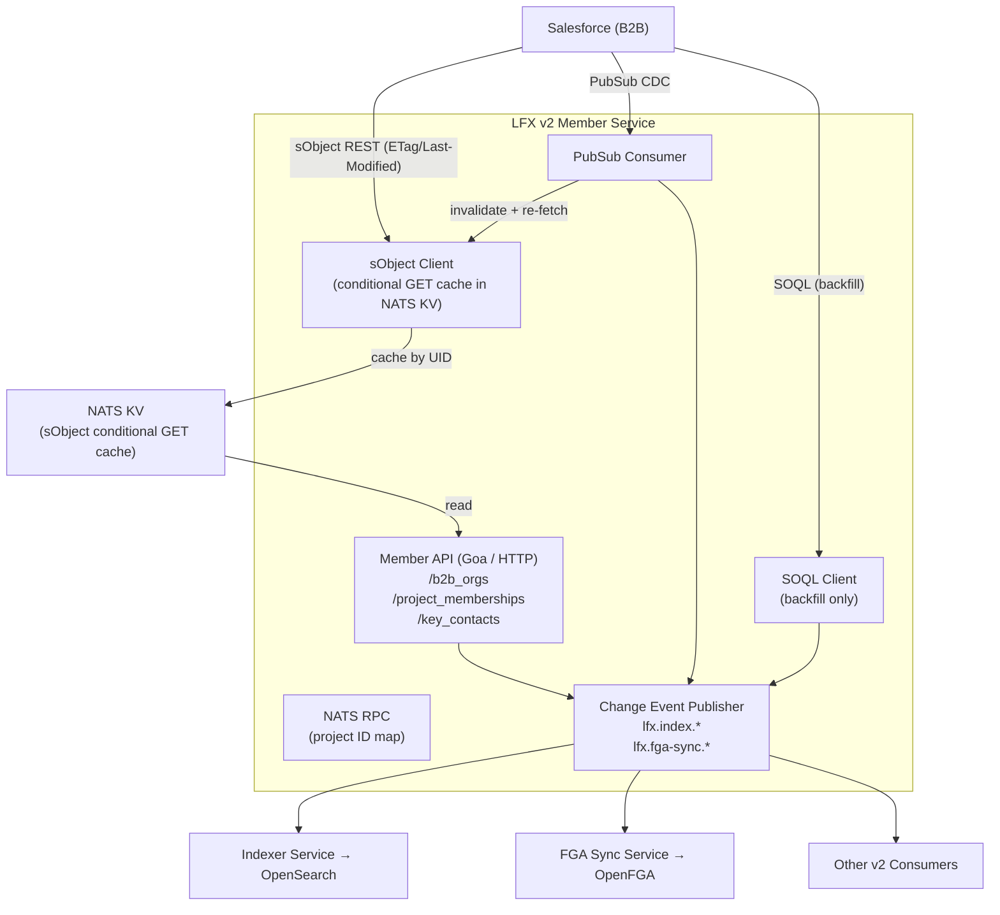

<!--
Copyright The Linux Foundation and each contributor to LFX.
SPDX-License-Identifier: CC-BY-4.0
-->

# V2 Member Service Architecture

This document describes the current architecture of the LFX v2 Member Service and the proposed
implementation plan for graduating it to full v2 platform idioms: OpenFGA fine-grained
authorization, OpenSearch indexing via the Indexer Service, and a clean v2 API surface.

## Current State

The v2 member service is currently a **read/write Salesforce B2B proxy** with a NATS KV caching
layer. The PostgreSQL replica dependency from the v1 platform has been fully removed. The service
now:

1. Queries Salesforce directly via SOQL (the `salesforce` infrastructure package) for all reads.
2. Caches SOQL responses in NATS KV as paginated result batches (stale-while-revalidate) to
   reduce Salesforce round-trips and serve collection endpoints.
3. Exposes write endpoints for key contacts (create / update / delete) that mutate
   `Project_Role__c` records in Salesforce and invalidate the relevant KV cache entries.
4. Publishes a NATS RPC endpoint (`lfx.member.project-id-map.lookup`) that other services can
   use to resolve a v2 project UID to its Salesforce `Project__c.Id`.
5. Resolves project UIDs ↔ slugs via NATS RPC calls to the project-service.

### Current API layout

All v2 member service endpoints live under a project drill-down hierarchy. Most collection
endpoints are served via a SOQL-backed NATS KV cache: on a cache miss (or stale hit) the service
issues a SOQL query to Salesforce, writes the result into KV, and returns it; fresh cache hits are
served directly from KV without a Salesforce round-trip. The exception is the tiers list
(`GET /projects/{project_uid}/tiers`), which is served directly from Salesforce on every request
— individual tiers are cached by UID for single-record lookups but the list result is not cached
as a unit.

| Method | Path | Description | FGA check |
|--------|------|-------------|-----------|
| GET | `/projects/{project_uid}/tiers` | List membership tiers (Product2) | `auditor` on `project:{project_uid}` |
| GET | `/projects/{project_uid}/tiers/{tier_uid}` | Get a membership tier | `auditor` on `project:{project_uid}` |
| GET | `/projects/{project_uid}/memberships` | List project memberships (Assets) | `auditor` on `project:{project_uid}` |
| GET | `/projects/{project_uid}/memberships/{membership_uid}` | Get a membership | `auditor` on `project:{project_uid}` |
| GET | `/projects/{project_uid}/memberships/{membership_uid}/key_contacts` | List key contacts | `auditor` on `project:{project_uid}` |
| GET | `/projects/{project_uid}/memberships/{membership_uid}/key_contacts/{contact_uid}` | Get a key contact | `auditor` on `project:{project_uid}` |
| POST | `/projects/{project_uid}/memberships/{membership_uid}/key_contacts` | Create a key contact | `writer` on `project:{project_uid}` |
| PUT | `/projects/{project_uid}/memberships/{membership_uid}/key_contacts/{contact_uid}` | Update a key contact | `writer` on `project:{project_uid}` |
| DELETE | `/projects/{project_uid}/memberships/{membership_uid}/key_contacts/{contact_uid}` | Delete a key contact | `writer` on `project:{project_uid}` |

Authorization is checked by the Heimdall API gateway exclusively using the
`project` OpenFGA type without access for key contacts themselves, or other
organization-authorized individuals. This is the primary gap the next phase must
close.

### Current domain model

```
model/
  MembershipTier       — Product2 record scoped to a project
  ProjectMembership    — Asset record scoped to a project (company attrs denormalized)
  ProjectKeyContact    — Project_Role__c record (contact + company attrs denormalized)
  KeyContactInput      — Mutable fields for create / update
```

The `member` OpenFGA type exists in the platform model but is not yet used — current permission
checks are delegated entirely to the `project` type.

### Current NATS KV bucket layout

NATS KV (bucket `membership-cache`) serves as a stale-while-revalidate cache in front of
Salesforce. There are no lookup-index keys; collection results are stored as paginated SOQL
result batches. All key types below live in the single `membership-cache` bucket, namespaced
by type prefix.

| Key pattern | Value | TTL |
|-------------|-------|-----|
| `tier.{tier_uid}` | `model.MembershipTier` (JSON) | 24 h |
| `membership.{membership_uid}` | `model.ProjectMembership` (JSON) | 24 h |
| `key-contacts.{membership_uid}` | `[]*model.ProjectKeyContact` (JSON array) | 24 h |
| `soql.memberships-by-project.{base64(sfid)}.{base64(sort)}[.{base64(tierSFID)}][.{base64(search:term)}].{batch_index_or_iterator}` | batch of `model.ProjectMembership` records + next-batch iterator (JSON) | 24 h |
| `project-sfid.{project_uid}` | Salesforce `Project__c.Id` string | 24 h |
| `project-uid.{slug}` | v2 project UID string | 24 h |

Collection list endpoints (e.g. `GET /projects/{uid}/memberships`) are served by slicing the
appropriate batched-SOQL cache entry. On a cache miss the service runs the full SOQL query,
writes results into KV split across one or more batch entries (written tail-first so every
batch's next-iterator is valid before the head is committed), then serves from the freshly-
written batch. On a stale hit the cached batch is returned immediately while a background
goroutine re-fetches batch 0 from Salesforce.

---

## Target Architecture

The goal of the next phase is to graduate the member service to full v2 platform idioms:

- **`b2b_org`**: a first-class OpenFGA type representing a Salesforce Account (B2B company), with
  its own `owner` and `writer` relations, replacing the implicit company identity embedded in
  every membership and key contact object.
- **`project_membership`**: promoted to a root-level API type (`/project_memberships/{uid}`) with
  its own indexer pipeline and FGA relations to its parent `b2b_org` and `project`.
- **`key_contact`**: promoted to a root-level API type (`/key_contacts/{uid}`) with FGA relations
  to both its parent `project` and parent `b2b_org`.
- **sObject API + conditional GET caching replaces SOQL-backed KV**: individual object reads use
  the Salesforce sObject REST API with `ETag`/`If-None-Match` and `Last-Modified`/`If-Modified-Since`
  conditional request headers, with responses cached in NATS KV by UID only. SOQL is retained
  exclusively for triggerable backfill/reindex operations.
- **Query Service handles all collection serving**: list and search operations across all three
  types are served entirely by the Query Service (OpenSearch), not by this service. The service
  exposes only single-object GET, write (POST/PUT/DELETE), and a backfill trigger endpoint.
- **Indexer + FGA Sync pipelines**: all three types are published to OpenSearch and OpenFGA on
  every write and on every PubSub CDC event.
- **Salesforce PubSub CDC**: real-time change propagation from Salesforce drives cache
  invalidation and downstream index updates for all externally-initiated changes.



### Key design decisions

- **sObject API + conditional GETs for object reads.** Single-object reads use
  `GET /services/data/vXX.0/sobjects/{Type}/{Id}` with both `If-None-Match` (carrying the cached
  ETag) and `If-Modified-Since` (carrying the cached Last-Modified timestamp). A `304 Not Modified`
  response confirms the cached value is still valid without re-fetching the body, providing
  standard HTTP-level cache semantics. If 304 responses do not count towards our rate limits, we can revalidate on every object fetch; if not, we can also emulate `max-age` semantics (re-use a cached object _without_ revalidation for a certain number of seconds).
- **NATS KV as sObject cache only.** The lookup-index keys (e.g.
  `lookup/project/{project_id}/{membership_uid}`) are removed entirely. The Query Service
  (OpenSearch) is the authoritative source for filtered collections. NATS KV stores only one entry
  per object UID, holding the serialised domain object, its ETag, its Last-Modified timestamp, and a potential timestamp for `max-age` behavior.
- **SOQL is retained for backfill only.** Full-table SOQL queries are expensive
  and cannot easily support incremental pagination in a live-serving context.
  They shall be used exclusively by the triggerable reindex job, which may be
  invoked by an operator or by a startup flag.
- **No collection endpoints on this service.** The service does not implement list or search
  endpoints. All collection access is via the Query Service. The service's API surface is:
  single-object GET (served from sObject cache), write mutations, and a backfill trigger.
- **No backward-compatible project-scoped paths.** The old
  `/projects/{uid}/memberships/...` and `/projects/{uid}/memberships/{uid}/key_contacts/...`
  endpoints are removed. Consumers must migrate to the root paths and/or the Query Service.

---

## V2 Entity Model

### OpenFGA types

These types participate in the OpenFGA relationship model and are subject to fine-grained,
per-object access control. They are served from the root of the LFX API path.

#### `b2b_org`

Represents a Salesforce Account (B2B company). The UID is an invertible UUID v8 encoded from the
Salesforce Account SFID (see `pkg/sfuuid`).

There is no self-service user permission for creating new `b2b_org` objects. They are created
exclusively by machine users (EasyCLA, LFX Enrollment) whose OAuth client-ID principals are
members of a global `org_admin` team. That team is written as a **direct relation** on every
`b2b_org` object (not via a root-level singleton), providing `writer` access to all org admins
without requiring a hierarchical root object analogous to the `project` root.

```plain
type b2b_org
  relations
    # global_org_admin holds the platform-wide org admin team. Written to every
    # b2b_org at creation time by the member service. There is no "root" b2b_org;
    # the team relation is stamped directly on each object instance.
    define global_org_admin: [team#member]
    define owner: [user]
    define writer: [user] or owner or global_org_admin
    define auditor: [user, team#member] or writer
```

- **`global_org_admin`**: holds the platform-wide org-admin team. Set at creation; never
  managed per-resource. Provides `writer` (and transitively `auditor`) access to all org admins.
  Intentionally scoped to `writer`, not `owner`, so machine users do not acquire any future
  owner-only gates (e.g. org transfer or deletion).
- **`owner`**: individual human users who are owners of this org. Owners inherit `writer` access
  and are reserved for future owner-only operations.
- **`writer`**: individual users, owners, or global org-admin team members who can write
  memberships and key contacts on behalf of this org.
- **`auditor`**: individual users or team members with read access to all data associated with
  this org, including sensitive membership and contact details.

**FGA Sync payload (on create/update):**

```json
{
  "object_type": "b2b_org",
  "operation": "update_access",
  "data": {
    "uid": "<b2b_org_uid>",
    "relations": {
      "owner": ["<owner_username>"]
    },
    "references": {
      "global_org_admin": ["team:<global_org_admin_team_uid>"]
    }
  }
}
```

**Indexer payload:**

```json
{
  "action": "created",
  "headers": { "authorization": "Bearer <token>" },
  "data": {
    "uid": "{{ uid }}",
    "sfid": "{{ sfid }}",
    "name": "Acme Corp",
    "domain": "acme.com",
    "logo_url": "https://..."
  },
  "tags": [],
  "indexing_config": {
    "object_id": "{{ uid }}",
    "public": false,
    "access_check_object": "b2b_org:{{ uid }}",
    "access_check_relation": "auditor",
    "history_check_object": "b2b_org:{{ uid }}",
    "history_check_relation": "auditor",
    "sort_name": "{{ name }}",
    "name_and_aliases": ["{{ name }}", "{{ domain }}"],
    "fulltext": "{{ name }} {{ domain }}"
  }
}
```

---

#### `project_membership`

Represents a Salesforce Asset record: one active (or expired) membership term for a `b2b_org`
within a `project`. The UID is an invertible UUID v8 encoded from the Asset SFID.

Access is derived from the caller's relationship to the parent `b2b_org` (for org-scoped access)
and/or to the parent `project` (for project-scoped read access, e.g. LF staff). This service
exposes no API write path for `project_membership` — all mutations originate in Salesforce (via
the Sales team) and propagate to this service through PubSub CDC or the backfill trigger.

```plain
type project_membership
  relations
    define b2b_org: [b2b_org]
    define project: [project]
    define auditor: auditor from b2b_org or auditor from project
```

- **`b2b_org`**: reference to the owning org. Set at creation, never changed.
- **`project`**: reference to the project this membership belongs to. Set at creation, never
  changed.
- **`auditor`**: inherits `auditor` from the `b2b_org` (org auditors, owners, global org admins)
  **or** from the `project` (project auditors, writers, owners).

**FGA Sync payload (on create/update):**

```json
{
  "object_type": "project_membership",
  "operation": "update_access",
  "data": {
    "uid": "<membership_uid>",
    "references": {
      "b2b_org": ["b2b_org:<b2b_org_uid>"],
      "project": ["project:<project_uid>"]
    }
  }
}
```

**Indexer payload:**

```json
{
  "action": "created",
  "headers": { "authorization": "Bearer <token>" },
  "data": {
    "uid": "{{ uid }}",
    "b2b_org_uid": "{{ b2b_org_uid }}",
    "project_uid": "{{ project_uid }}",
    "tier_uid": "{{ tier_uid }}",
    "status": "Active",
    "year": "2025",
    "tier": "Gold",
    "membership_type": "Corporate",
    "start_date": "2025-01-01",
    "end_date": "2025-12-31",
    "company_name": "Acme Corp",
    "company_logo_url": "https://...",
    "company_domain": "acme.com",
    "tier_name": "Gold Corporate Membership"
  },
  "tags": ["status", "tier", "membership_type", "year"],
  "indexing_config": {
    "object_id": "{{ uid }}",
    "public": false,
    "access_check_object": "project_membership:{{ uid }}",
    "access_check_relation": "auditor",
    "history_check_object": "project_membership:{{ uid }}",
    "history_check_relation": "auditor",
    "sort_name": "{{ company_name }}",
    "name_and_aliases": ["{{ company_name }}", "{{ company_domain }}"],
    "parent_refs": ["b2b_org:{{ b2b_org_uid }}", "project:{{ project_uid }}"],
    "fulltext": "{{ company_name }} {{ tier_name }} {{ status }} {{ year }}"
  }
}
```

---

#### `key_contact`

Represents a Salesforce `Project_Role__c` record: a named contact role assigned to a `b2b_org`
for a specific `project` membership. The UID is an invertible UUID v8 encoded from the
`Project_Role__c` SFID.

Write access is granted to `b2b_org` writers (owners and the global org-admin team) and to
project-level writers (LF staff managing contacts on behalf of members).

```plain
type key_contact
  relations
    define b2b_org: [b2b_org]
    define project: [project]
    define writer: writer from b2b_org or writer from project
    define auditor: auditor from b2b_org or auditor from project
```

- **`b2b_org`**: reference to the owning org. Set at creation from the membership's `b2b_org_uid`.
- **`project`**: reference to the project. Set at creation from the membership's `project_uid`.
  Allows project auditors (staff) to read all key contacts for a project without being granted
  per-org access.
- **`writer`**: inherits `writer` from the `b2b_org` (org owners, global org admins) **or** from
  the `project` (LF staff). This differs from `project_membership`, where only org-side writers
  can modify records.
- **`auditor`**: inherits from `b2b_org` **or** `project` (same pattern as `project_membership`).

**FGA Sync payload (on create/update):**

```json
{
  "object_type": "key_contact",
  "operation": "update_access",
  "data": {
    "uid": "<key_contact_uid>",
    "references": {
      "b2b_org": ["b2b_org:<b2b_org_uid>"],
      "project": ["project:<project_uid>"]
    }
  }
}
```

**Indexer payload:**

```json
{
  "action": "created",
  "headers": { "authorization": "Bearer <token>" },
  "data": {
    "uid": "{{ uid }}",
    "b2b_org_uid": "{{ b2b_org_uid }}",
    "project_uid": "{{ project_uid }}",
    "membership_uid": "{{ membership_uid }}",
    "role": "Voting Representative",
    "status": "Active",
    "board_member": false,
    "primary_contact": false,
    "first_name": "Jane",
    "last_name": "Doe",
    "title": "CTO",
    "email": "jane.doe@acme.com",
    "company_name": "Acme Corp",
    "company_logo_url": "https://...",
    "company_domain": "acme.com"
  },
  "tags": ["role", "status", "board_member", "primary_contact"],
  "indexing_config": {
    "object_id": "{{ uid }}",
    "public": false,
    "access_check_object": "key_contact:{{ uid }}",
    "access_check_relation": "auditor",
    "history_check_object": "key_contact:{{ uid }}",
    "history_check_relation": "auditor",
    "sort_name": "{{ last_name }} {{ first_name }}",
    "name_and_aliases": ["{{ first_name }} {{ last_name }}", "{{ email }}"],
    "parent_refs": [
      "b2b_org:{{ b2b_org_uid }}",
      "project:{{ project_uid }}",
      "project_membership:{{ membership_uid }}"
    ],
    "contacts": [
      {
        "lfx_principal": "{{ uid }}",
        "name": "{{ first_name }} {{ last_name }}",
        "emails": ["{{ email }}"]
      }
    ],
    "fulltext": "{{ first_name }} {{ last_name }} {{ email }} {{ role }} {{ company_name }}"
  }
}
```

---

### Pseudotypes (Indexer / Query Service only)

These types are indexed into OpenSearch and queryable via the Query Service. They do not appear in
the OpenFGA model and carry no per-object permission tuples; access is mediated by the OpenFGA
relations on the root types above.

| Pseudotype | Description | API path | Permission anchor |
|------------|-------------|----------|-------------------|
| `membership_tier` | A Salesforce Product2 record (membership product offered under a project). | N/A (Query Service) | `auditor` on `project:{project_uid}` |

`membership_tier` does not require its own FGA type: different tiers on a project do not have
different admins. Tier access is always derived from the parent project relation.

---

### Entity attribute sets

Following the platform's [entity design guidance](https://github.com/linuxfoundation/lfx-v2-helm/blob/main/docs/entity-design.md),
the entity model uses a single attribute set per root type. All attributes are served from the
single root endpoint and guarded by the `auditor` relation for reads and `writer` for mutations.

If future business requirements introduce attributes that need finer-grained permission boundaries
(e.g., formation details on a `b2b_org` writable only by `owner`), a new endpoint and attribute
set should be introduced following the platform's split-attribute pattern.

---

## Target API Layout

The service exposes only **single-object reads, write mutations, and a backfill trigger**. All
list and search operations are delegated to the Query Service (OpenSearch). There are no
backward-compatible aliases for the old project-scoped paths.

### `b2b_org`

| Method | Path | Description | FGA check |
|--------|------|-------------|-----------|
| GET | `/b2b_orgs/{uid}` | Get a b2b org (sObject cache) | `auditor` on `b2b_org:{uid}` |
| POST | `/b2b_orgs` | Create a b2b org (machine users only) | `member` of `global_org_admin` team |
| PUT | `/b2b_orgs/{uid}` | Update a b2b org | `writer` on `b2b_org:{uid}` |

> **Note:** There is no self-service user permission for `POST /b2b_orgs`. The create endpoint
> checks only the caller's membership in the global org-admin team (populated at deploy time with
> the EasyCLA and LFX Enrollment client-ID principals). This is unlike projects, where any user
> with a `writer` relation to a parent project can create a child project.
>
> List/search `b2b_org`: **Query Service** — `auditor` on `b2b_org:{uid}`.

### `project_membership`

| Method | Path | Description | FGA check |
|--------|------|-------------|-----------|
| GET | `/project_memberships/{uid}` | Get a membership (sObject cache) | `auditor` on `project_membership:{uid}` |

> **Note:** Membership lifecycle operations (creation, cancellation, auto-renewal changes, etc.)
> are managed by the LF Sales team directly in Salesforce. This service exposes no write
> endpoints for `project_membership`; all mutations arrive via Salesforce PubSub CDC or the
> backfill trigger.
>
> List/search `project_membership`: **Query Service** — `auditor` on `project_membership:{uid}`,
> filterable by `parent_refs` (e.g. `b2b_org:{uid}` or `project:{uid}`).

### `key_contact`

| Method | Path | Description | FGA check |
|--------|------|-------------|-----------|
| GET | `/key_contacts/{uid}` | Get a key contact (sObject cache) | `auditor` on `key_contact:{uid}` |
| POST | `/key_contacts` | Create a key contact | `writer` on `b2b_org:{b2b_org_uid}` (from payload) |
| PUT | `/key_contacts/{uid}` | Update a key contact | `writer` on `key_contact:{uid}` |
| DELETE | `/key_contacts/{uid}` | Delete a key contact | `writer` on `key_contact:{uid}` |

> List/search `key_contact`: **Query Service** — `auditor` on `key_contact:{uid}`, filterable by
> `parent_refs` (e.g. `b2b_org:{uid}`, `project:{uid}`, or `project_membership:{uid}`).

### Backfill trigger

| Method | Path | Description | FGA check |
|--------|------|-------------|-----------|
| POST | `/admin/reindex` | Trigger an indexer backfill run | `member` of `global_org_admin` team |

See the [Indexer Backfill](#indexer-backfill) section for details.

---

## OpenFGA Model Fragment

The following block shows the additions to the platform-wide OpenFGA model
(`lfx-v2-helm/charts/lfx-platform/templates/openfga/model.yaml`) required by this service.
The `project` and `team` types are already defined; only the new types are shown.

```plain
type b2b_org
  relations
    # global_org_admin holds the platform-wide org admin team. This relation is
    # written to every b2b_org at creation time by the member service. There is
    # no "root" b2b_org; the team is added as a direct relation on each object.
    # Placed in writer (not owner) to reserve owner for future owner-only gates.
    define global_org_admin: [team#member]
    define owner: [user]
    define writer: [user] or owner or global_org_admin
    define auditor: [user, team#member] or writer

type project_membership
  relations
    define b2b_org: [b2b_org]
    define project: [project]
    # No writer relation: membership lifecycle is managed in Salesforce by the
    # Sales team. Mutations reach this service only via PubSub CDC or backfill.
    define auditor: auditor from b2b_org or auditor from project

type key_contact
  relations
    define b2b_org: [b2b_org]
    define project: [project]
    define writer: writer from b2b_org or writer from project
    define auditor: auditor from b2b_org or auditor from project
```

The stub `member` type currently in the model should be removed after confirming no existing
tuples reference it (or after a migration sweep).

---

## Salesforce Integration

### sObject API + conditional GET caching (primary read path)

Individual object reads use the Salesforce sObject REST API:

```
GET /services/data/vXX.0/sobjects/{Type}/{SalesforceId}
If-None-Match: "<cached_etag>"
If-Modified-Since: "<cached_last_modified>"
```

- A `200 OK` response returns the updated body with new `ETag` and `Last-Modified` response
  headers; the NATS KV entry is refreshed with the new body, ETag, and Last-Modified timestamp.
- A `304 Not Modified` response confirms the cached value is still valid; no KV write is
  needed.

The NATS KV cache stores one entry per v2 UID:

| Bucket | Key | Value |
|--------|-----|-------|
| `member-service-cache` | `b2b_org.{uid}` | `{etag, last_modified, data}` (JSON) |
| `member-service-cache` | `project_membership.{uid}` | `{etag, last_modified, data}` (JSON) |
| `member-service-cache` | `key_contact.{uid}` | `{etag, last_modified, data}` (JSON) |

No lookup-index keys are stored. Collection access is entirely the Query Service's concern.

**Read-your-writes:** after any successful write to Salesforce, the service must immediately
update the corresponding KV entry (with the new ETag, Last-Modified, and body returned by the
write response) before
returning the HTTP response to the caller. This ensures subsequent GET requests are coherent
without a round-trip to Salesforce.

### Salesforce PubSub CDC (real-time invalidation)

The PubSub consumer subscribes to Salesforce Change Data Capture channels for `Account`,
`Asset`, and `Project_Role__c`. On each event it:

1. Re-fetches the affected sObject via the sObject API (unconditionally, without `If-None-Match` or `If-Modified-Since`,
   since the CDC event implies staleness).
2. Refreshes the NATS KV entry with the new body, ETag, and Last-Modified timestamp.
3. Publishes Indexer and FGA Sync messages so downstream indexes stay current.

### SOQL (backfill only)

SOQL is retained for the **triggerable reindex** path only. The service does not use SOQL for
live request serving. Each type requires its own query with the joins necessary to produce the
full denormalized payload for that type — the exact field set and join structure is determined
by the v2 entity contract for that type, not the SOQL queries currently in use. For example:

- **`b2b_org`**: a new type with no prior query; selects from `Account` with whatever related
  objects are needed to populate the v2 `B2BOrg` fields.
- **`project_membership`**: selects from `Asset` joined to `Account`, `Product2`, and
  `Project__c` — but the fields projected and the relationship structure must match the v2
  `ProjectMembership` domain model, which may differ from the old PostgreSQL query.
- **`key_contact`**: selects from `Project_Role__c` joined to `Contact`, `Alternate_Email__c`,
  `Asset`, `Account`, and `Project__c` — again shaped to match the v2 `KeyContact` domain
  model exactly.

Each query pages through results via SOQL query locators and re-publishes Indexer messages for
all records of the requested type.

---

## Indexer Backfill

The backfill mechanism re-publishes Indexer and FGA Sync messages for all records of one or more
types, without affecting the live NATS KV cache. It is triggered via the `POST /admin/reindex`
endpoint.

### Request body

```json
{
  "types": ["b2b_org", "project_membership", "key_contact"]
}
```

- **`types`**: one or more of `b2b_org`, `project_membership`, `key_contact`,
  `membership_tier`. If omitted, all types are reindexed.

### Denormalization contract

The v2 denormalized entity payload (the `data` object in every Indexer message) must be
**identical** regardless of how it was assembled:

- **Live path**: multiple individual sObject fetches (one per related object) triggered by a
  write or PubSub CDC event.
- **Backfill path**: a single SOQL query with multi-table joins (e.g. `Project_Role__c` joined
  to `Contact`, `Alternate_Email__c`, `Asset`, `Account`, `Product2`).

Field names, types, null handling, and value transformations must produce byte-for-byte
equivalent JSON for the same underlying Salesforce record on both paths. Divergence here causes
silent inconsistencies between the live index and a post-backfill index that are very difficult
to detect in production.

**This contract must be enforced by tests.** For each type, there should be a test that:

1. Constructs the expected denormalized struct from a fixture set of raw Salesforce field values.
2. Runs the same fixture data through both the sObject assembly path and the SOQL join-row
   mapping path.
3. Asserts that both produce an identical domain object (and therefore an identical Indexer
   payload).

These tests live alongside the respective infrastructure adapters and must be kept in sync
whenever field mappings change on either path.

### Behaviour

1. For each requested type, the service runs the appropriate SOQL query to page through all
   Salesforce records of that type (applying any scope restriction, e.g. active-only).
2. For each record, it constructs the full denormalized domain object via the SOQL join-row
   mapping path (see denormalization contract above) and publishes both an `updated` Indexer
   message and an FGA Sync `update_access` message. Both operations are idempotent; the
   backfill is safe to run multiple times.
3. Progress is logged via structured log lines; the endpoint returns `202 Accepted` immediately
   and runs the backfill asynchronously.

> The backfill does **not** modify the NATS KV sObject cache. It is purely an Indexer/FGA
> re-publication pass. The sObject cache is external (NATS KV persists independently of the
> service) so restarting the service has no effect on cached entries. To force re-validation,
> operators must delete the relevant KV entries manually (or purge the bucket); the next GET
> request for each affected object will then re-fetch from Salesforce and repopulate the cache.

---

## Heimdall RuleSet Changes

The Heimdall RuleSet must be updated to:

1. **Remove all project-scoped rules** for the old drill-down paths.
2. **Add rules for the new root paths** (`/b2b_orgs/...`, `/project_memberships/...`,
   `/key_contacts/...`).
3. **The `POST /b2b_orgs` and `POST /admin/reindex` rules** check team membership against the
   global org-admin team rather than a per-resource object. The team UID is injected as a static
   chart value (`app.globalOrgAdminTeamUID`).
4. **No write rules for `project_memberships`.** The only Heimdall rule needed for this path is
   a `GET` read rule. Membership lifecycle (creation, cancellation, auto-renewal) is handled by
   the LF Sales team in Salesforce; no direct-write HTTP rules are required.

Example rule sketch for `POST /b2b_orgs` (team membership check):

```yaml
- id: "rule:lfx:lfx-v2-member-service:b2b_orgs:create"
  match:
    methods: [POST]
    routes:
      - path: /b2b_orgs
  execute:
    - authenticator: oidc
    - authorizer: openfga_check
      config:
        values:
          relation: member
          object: "team:{{ .Values.app.globalOrgAdminTeamUID }}"
    - finalizer: create_jwt
```

Example rule for `PUT /key_contacts/{uid}` (per-resource object check):

```yaml
- id: "rule:lfx:lfx-v2-member-service:key-contacts:update"
  match:
    methods: [PUT]
    routes:
      - path: /key_contacts/:uid
  execute:
    - authenticator: oidc
    - authorizer: openfga_check
      config:
        values:
          relation: writer
          object: "key_contact:{{- .Request.URL.Captures.uid -}}"
    - finalizer: create_jwt
```

---

## Domain Model Changes

### Rename: `member` → `b2b_org`

The internal domain concept currently called `member` (which already represents a Salesforce
Account / B2B company) should be renamed to `b2b_org` throughout:

- `model.Member` → `model.B2BOrg`
- `model.ProjectMembership` → `model.ProjectMembership` (unchanged — the type name is already
  accurate for the v2 entity)
- `model.ProjectKeyContact` → `model.KeyContact` (drop the `Project` prefix; project scope is
  carried as a field)

New fields required on existing models:

```go
// B2BOrg — the Salesforce Account, new top-level type
type B2BOrg struct {
    UID     string    `json:"uid"`         // invertible UUID v8 from Account SFID
    SFID    string    `json:"-"`           // raw Salesforce Account.Id (internal only)
    Name    string    `json:"name"`
    Domain  string    `json:"domain,omitempty"`
    LogoURL string    `json:"logo_url,omitempty"`
    CreatedAt time.Time `json:"created_at"`
    UpdatedAt time.Time `json:"updated_at"`
}

// ProjectMembership — add B2BOrgUID (currently only AccountSFID is stored internally)
type ProjectMembership struct {
    // ... existing fields ...
    B2BOrgUID string `json:"b2b_org_uid"` // NEW: exposed in API response and indexer payload
}

// KeyContact — add B2BOrgUID (currently derived but not surfaced on the struct)
type KeyContact struct {
    // ... (renamed from ProjectKeyContact; existing fields unchanged) ...
    B2BOrgUID string `json:"b2b_org_uid"` // NEW: exposed in API response and indexer payload
}
```

`B2BOrgUID` is derived deterministically via `sfuuid.FromSFID(accountSFID)` — the SOQL and
sObject queries already fetch the Account SFID, so no additional Salesforce round-trips are
needed.

### New port: `B2BOrgReader`

```go
type B2BOrgReader interface {
    GetB2BOrg(ctx context.Context, uid string) (*model.B2BOrg, error)
}
```

### New port: `B2BOrgWriter`

```go
type B2BOrgWriter interface {
    CreateB2BOrg(ctx context.Context, sfid string) (*model.B2BOrg, error)
    UpdateB2BOrg(ctx context.Context, uid string, input model.B2BOrgInput) (*model.B2BOrg, error)
}
```

### New port: `EventPublisher`

```go
type EventPublisher interface {
    PublishIndexerEvent(ctx context.Context, objectType, action string, data any, cfg *indexertypes.IndexingConfig) error
    PublishFGASyncEvent(ctx context.Context, msg fgasync.GenericFGAMessage) error
}
```

### Removed ports

- `MembershipSourceReader` (SOQL-backed) — replaced by `sObjectReader` (ETag/Last-Modified-aware) for live
  serving, and a `BackfillRunner` for reindex operations.
- All NATS KV lookup-index writers — removed; the Query Service is the only collection index.
- No `MembershipWriter` port is introduced — `project_membership` records are written exclusively
  in Salesforce by the LF Sales team. There is no API write path for this type; mutations reach
  this service only via PubSub CDC or the backfill trigger.

---

## Implementation Plan

### Step 1: OpenFGA model update (lfx-v2-helm)

- Add `b2b_org`, `project_membership`, and `key_contact` type definitions to
  `charts/lfx-platform/templates/openfga/model.yaml`.
- Bump the model **major** version (type additions/deletions require a major bump per the
  in-file versioning guidelines).
- Remove the stub `member` type (after confirming no existing tuples reference it).

### Step 2: sObject client and conditional GET cache

- Implement a `sObjectClient` that wraps the Salesforce sObject REST API with `If-None-Match`/`If-Modified-Since`
  conditional GETs and stores `{etag, last_modified, data}` entries in a `member-service-cache` NATS KV bucket.
- Implement `sObjectReader` adapters for `B2BOrg`, `ProjectMembership`, and `KeyContact` that
  call `sObjectClient` and deserialise into the domain model types.
- Remove the SOQL-backed KV reader and all lookup-index bucket reads/writes.

### Step 3: Rename internal types and add `b2b_org_uid`

- Rename `model.Member` → `model.B2BOrg`; update all callsites.
- Rename `model.ProjectKeyContact` → `model.KeyContact`; update all callsites.
- Add `B2BOrgUID` field to `ProjectMembership` and `KeyContact`; populate from `AccountSFID`
  via `sfuuid.FromSFID` in the Salesforce infrastructure layer.

### Step 4: Root API paths (Goa design)

- Add `b2b_org` (GET/POST/PUT) and `key_contact` (GET/POST/PUT/DELETE) service methods to the
  Goa design at the root paths described in the Target API Layout section above.
- Add `project_membership` GET only — no write methods (lifecycle is managed in Salesforce by
  the Sales team; mutations arrive via PubSub CDC or backfill, not the HTTP API).
- Remove all project-scoped drill-down methods entirely (no aliases, no 410 stubs).
- Regenerate the Goa server code (`make gen`).

### Step 5: FGA Sync integration

- On every create / update / delete of a `b2b_org` or `key_contact` (via the HTTP API), and on
  every `project_membership` change received via PubSub CDC or backfill, publish a FGA Sync
  message via the `EventPublisher` port using the payloads defined in the entity model section
  above.
- The FGA Sync message for `b2b_org` creation must always include the `global_org_admin`
  reference (team UID loaded from config at startup).
- On delete, publish a `delete_access` message to remove all FGA tuples for the object.

### Step 6: Indexer integration

- On every create / update / delete and on every PubSub CDC event, publish an Indexer message
  via the `EventPublisher` port.
- NATS subjects: `lfx.index.b2b_org`, `lfx.index.project_membership`, `lfx.index.key_contact`,
  `lfx.index.membership_tier`.

### Step 7: PubSub CDC consumer

- Subscribe to `AccountChangeEvent`, `AssetChangeEvent`, and `Project_Role__cChangeEvent` CDC
  channels.
- On each event: unconditionally re-fetch the affected sObject, refresh the NATS KV cache
  entry, and publish Indexer + FGA Sync messages.

### Step 8: Indexer backfill endpoint

- Implement the `BackfillRunner` which runs SOQL paged queries for each requested type and
  publishes Indexer and FGA Sync messages for every record.
- Add the `POST /admin/reindex` Goa method with the global org-admin team membership check.
- Run as an asynchronous goroutine; return `202 Accepted` immediately with a run ID for log
  correlation.

### Step 9: Heimdall RuleSet update

- Update `charts/lfx-v2-member-service/templates/ruleset.yaml`: remove all project-scoped
  rules, add rules for the new root paths and the team-membership-based create/reindex rules.

---

## Environment Variable Reference

| Variable | Description | Required |
|----------|-------------|----------|
| `SF_INSTANCE_URL` | Salesforce instance URL | Yes |
| `SF_CLIENT_ID` | Salesforce connected app client ID | Yes |
| `SF_CLIENT_SECRET` | Salesforce connected app client secret | Conditional (not required for JWT bearer flow) |
| `SF_API_VERSION` | Salesforce API version (default: `v63.0`) | No |
| `SF_PUBSUB_ENDPOINT` | Salesforce PubSub gRPC endpoint (Step 7) | Step 7 |
| `GLOBAL_ORG_ADMIN_TEAM_UID` | v2 UID of the global org-admin team; written as `global_org_admin` on every `b2b_org` at creation | Yes (Step 5+) |
| `NATS_URL` | NATS server URL | Yes |
| `PROJECT_RPC_TIMEOUT` | Timeout for project-service NATS RPC calls (default: `5s`) | No |

---

## Lessons from the V1 Implementation

The v1 `member-management` service has been running this Salesforce integration in production for
several years. The following patterns and failure modes remain relevant.

### Read-your-writes via the sObject cache

After a successful Salesforce write, the service must immediately update the NATS KV sObject
cache entry (with the new ETag, Last-Modified, and body returned by the write API) before returning the HTTP
response to the caller. Because the v2 UID is derived deterministically from the SFDC ID
returned synchronously by the write API (`sfuuid.FromSFID`), no temporary ID indirection is
needed — unlike the v1 `temp_sfdc_id` shadow-row pattern.

### Write-path race conditions and retry logic

**Require `If-Match` or `If-Unmodified-Since` on mutating requests.** `PUT` and `DELETE`
endpoints should reject requests that do not carry either an `If-Match` header (containing the
ETag last returned for that object) or an `If-Unmodified-Since` header (containing the
Last-Modified timestamp). The service forwards whichever header the client supplied to the
Salesforce sObject API, which enforces the precondition natively and returns `412 Precondition
Failed` if the record has been modified since the client last read it. This eliminates lost-update
races without requiring any application-level locking.

Concurrent duplicate creation attempts (e.g. two simultaneous `POST /key_contacts` for the same
contact) are a separate concern and must be guarded with either a NATS KV compare-and-set (CAS)
lock or an application-level distributed lock keyed on the contact email + membership UID.
Salesforce may also return exclusive-lock contention errors on concurrent writes to related
records; treat these as retryable with exponential backoff and jitter.

### Post-write event failure handling

If the NATS KV write, Indexer publish, or FGA Sync publish fails after a successful Salesforce
write, log the failure with enough context (object type, UID, SFID) for the backfill endpoint to
repair the downstream indexes. Do not fail the HTTP response: the Salesforce record is durably
written; only the cache and indexes are temporarily stale.

### Key contact denormalization cost

Constructing a fully-denormalized `KeyContact` (or `ProjectMembership`) requires data from
multiple Salesforce objects: `Project_Role__c`, `Contact`, `Alternate_Email__c`, `Asset`,
`Account`, and `Product2`. For PubSub CDC events and backfill, this multi-object fetch is
unavoidable. The sObject cache amortises this cost for live GET requests: a cache hit requires
only one NATS KV read and zero Salesforce calls.

### Salesforce session management

Prefer **OAuth 2.0 JWT Bearer flow** (private key + client ID); retain
username/password as a fallback configuration pattern. Refresh tokens
proactively before expiry rather than reactively on 401. Share the token source
across goroutines with a mutex or a `golang.org/x/oauth2` token-source
abstraction.

---

## Open Questions

1. **Global org-admin team UID.** Confirm the v2 UID of the global org-admin team and how it is
   provisioned (manually via `lfx-v2-mockdata`, or automatically at deploy time).
2. **`b2b_org` create trigger.** Confirm whether `b2b_org` objects are created on first PubSub
   CDC event (async, driven by Salesforce) or eagerly via a `POST /b2b_orgs` call by EasyCLA /
   LFX Enrollment. The FGA and Indexer payloads are the same either way; the HTTP endpoint is
   only needed for the latter.
3. **Salesforce PubSub CDC channels.** Confirm the exact CDC channel names for `Account`,
   `Asset`, and `Project_Role__c` objects on the B2B org and whether custom CDC is enabled.
4. **`b2b_org` owner assignment.** Confirm whether `owner` relations on `b2b_org` are managed
   by this service (via a sub-collection endpoint) or directly by EasyCLA / LFX Enrollment via
   FGA Sync.
5. **Backfill scope.** Determine whether the default backfill covers all historical membership
   records or only active ones, and whether scope can be narrowed by project or org via query
   parameters on the trigger endpoint.
6. **`membership_tier` indexing.** Confirm whether `membership_tier` (Product2) records need
   their own backfill path, or whether tier data is sufficiently denormalized onto
   `project_membership` objects for all consumer use-cases.
